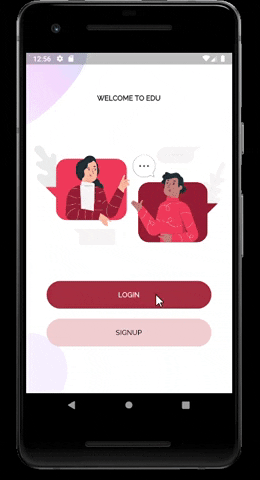
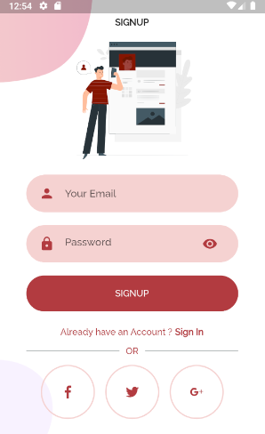

<h1 align="center">
 
Login Page 👋🏼
</h1>

📲 Beautiful designed Flutter App for login and register. 📲

  

## Screenshot 📷
<pre>
                              
</pre>

<pre>
                              
</pre>

## License 📃

This project is licensed under the MIT License - see the [LICENSE](https://opensource.org/licenses/MIT) page for details.
